# Azure Local Deploy

> **One command. Zero touch. Factory-default Dell servers become a production Azure Local cluster.**

Automated bare-metal-to-cluster deployment of **Microsoft Azure Local** (formerly Azure Stack HCI) on Dell PowerEdge servers via iDRAC Redfish. This application takes rack-mounted Dell servers from factory-default to a fully operational Azure Local cluster — including firmware updates, BIOS configuration, OS installation, network setup, Azure Arc onboarding, cloud-orchestrated cluster creation, and Day 2 workload provisioning — all without touching a single server physically.

Whether you are deploying a 2-node cluster in a branch office, a 16-node cluster in a core datacenter, or expanding an existing environment, Azure Local Deploy gives you a single, repeatable, auditable pipeline that replaces hours of manual console work with a single command or a few clicks in a browser.

---

## Table of Contents

- [What Is This App For?](#what-is-this-app-for)
- [Who Should Use This?](#who-should-use-this)
- [Architecture Overview](#architecture-overview)
- [Pipeline Stages](#pipeline-stages)
- [Deployment Flow](#deployment-flow)
- [Prerequisites](#prerequisites)
- [Installation](#installation)
- [Configuration](#configuration)
- [How to Use — CLI](#how-to-use--cli)
- [How to Use — Web Wizard](#how-to-use--web-wizard)
- [Day 2 Services](#day-2-services)
- [Add Node to Existing Cluster](#add-node-to-existing-cluster)
- [Rebuild Cluster](#rebuild-cluster)
- [Environment Checker](#environment-checker)
- [BIOS Settings Reference](#bios-settings-reference)
- [Project Layout](#project-layout)
- [Authentication](#authentication)
- [Troubleshooting](#troubleshooting)
- [Development](#development)
- [License](#license)

---

## What Is This App For?

Deploying Azure Local on Dell servers is a multi-step process that traditionally requires datacenter technicians to physically interact with each server, configure BIOS settings in the iDRAC console, mount OS images, run PowerShell scripts, install agents, and finally create the cluster through the Azure portal. For a 4-node cluster, this can take an experienced engineer 6–8 hours of hands-on work, and any mistake in BIOS or network configuration can cascade into deployment failures hours later.

**Azure Local Deploy** automates this entire workflow. It connects to each Dell server's iDRAC out-of-band management interface via the Redfish REST API, performs all hardware preparation remotely, and then SSHes into each node for OS-level configuration. The result is a repeatable, auditable, zero-touch deployment that takes a set of factory-default Dell servers and produces a production-ready Azure Local cluster registered in your Azure subscription.

The application covers the full lifecycle — not just initial deployment but also cluster expansion (adding nodes), Day 2 services (creating logical networks, uploading VM images, provisioning test VMs), and ongoing operational validation. Every action the tool performs is logged, idempotent (safe to re-run), and can be executed selectively if you only need to repeat a specific phase.

### How does it work?

At its core, Azure Local Deploy is a pipeline engine. You describe your desired cluster in a single YAML configuration file — server IPs, Azure credentials, network layout, security preferences — and the application executes a series of stages that transform factory-default hardware into a working cluster. Think of it as "infrastructure as code for bare metal."

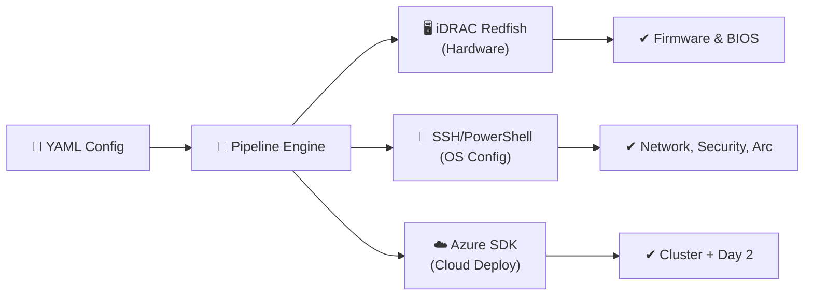

The pipeline runs in four phases:

1. **Azure & AD Preparation** — Registers Azure resource providers, validates your RBAC permissions, and prepares Active Directory objects (OU, deployment user, GPO inheritance blocking).
2. **Validation & Server Prep** — Connects to each iDRAC to validate hardware requirements, runs the Microsoft Environment Checker, applies firmware updates, and configures BIOS settings.
3. **OS & Node Configuration** — Deploys the Azure Local OS via virtual media, configures network adapters (including Network ATC), sets proxy and time settings, hardens security (HVCI, BitLocker, Credential Guard), and registers each node with Azure Arc.
4. **Cluster & Post-Deploy** — Provisions an Azure Key Vault for deployment secrets, creates a cloud witness storage account, triggers the cloud-orchestrated cluster deployment, and runs post-deployment tasks (health monitoring, volume creation, RDP enablement).

After the cluster is operational, a fifth workflow — **Day 2 Services** — creates logical networks, uploads VM images, and provisions test virtual machines so you can validate the environment immediately.

### Key capabilities

- **Zero-touch deployment** — No physical access required. Everything is done remotely via iDRAC Redfish and SSH.
- **Full pipeline** — 17 stages across 4 phases: Azure & AD prep, validation & server prep, OS & node config, and cluster deployment & post-deploy.
- **Pre-flight validation** — Catches hardware, configuration, reserved IP range conflicts, and DNS resolution problems before they cause deployment failures.
- **Microsoft Environment Checker** — Integrates the official `AzStackHci.EnvironmentChecker` module for readiness validation.
- **Web wizard** — Browser-based UI with real-time progress tracking for teams that prefer a graphical interface. 12-step new cluster wizard and 9-step add-node wizard.
- **Add-node support** — Full 15-stage pipeline (aligned with Microsoft docs) to expand existing clusters, including single-node to multi-node conversion. Handles OS drive cleaning, SBE deployment, Arc registration via `Invoke-AzStackHciArcInitialization`, pre-add quorum/storage intent setup, OS version matching, Arc parity validation, role assignment checks, and post-join `Sync-AzureStackHCI`.
- **Azure & AD preparation** — Automated resource provider registration, RBAC permission validation, and Active Directory OU/user/GPO creation.
- **Security baseline** — Applies the Microsoft-recommended security profile (HVCI, Credential Guard, BitLocker, SMB encryption, WDAC, drift control) with customizable overrides.
- **Key Vault & Cloud Witness** — Provisions the Azure Key Vault secrets store and configures a cloud witness storage account for cluster quorum.
- **Proxy support** — Configures proxy settings across WinInet, WinHTTP, and environment variables with automatic bypass entries.
- **Network ATC** — Optionally configures Network ATC intents for management, compute, and storage traffic types.
- **Post-deploy automation** — Validates Azure resource state, enables health monitoring, creates workload volumes, and optionally enables RDP.
- **Docs checker** — Fetches the latest Microsoft documentation and compares requirements against your configuration.
- **Idempotent stages** — Each stage checks current state before making changes, so re-running is safe.
- **Selective execution** — Run all stages or pick individual ones with `--stage`.
- **Day 2 workload services** — After cluster deployment, create logical networks (DHCP + static IP), upload VM images (Windows Server 2025, Windows 11), and provision test VMs with login credentials — all from the CLI or web wizard.

---

## Who Should Use This?

This application is designed for infrastructure engineers, datacenter operators, and DevOps teams who deploy and manage Azure Local clusters on Dell PowerEdge hardware. It is especially useful in:

| Scenario | How It Helps |
|---|---|
| **Greenfield deployments** | Takes factory-default servers to a production cluster in one pipeline run. No console access needed. |
| **Branch office rollouts** | Remote operators can deploy clusters at remote sites without on-site datacenter expertise. |
| **Standardized builds** | The YAML config serves as a declarative record of exactly how each cluster was built. Share it, version it, audit it. |
| **Cluster expansion** | Adding nodes to an existing cluster runs the same pipeline on the new server, then joins it to the cluster with automated compatibility checks. |
| **Day 2 operations** | After deployment, immediately set up networks and VMs to validate the platform or hand it off to application teams. |
| **Compliance & security** | Applies the Microsoft-recommended security baseline (HVCI, Credential Guard, BitLocker, WDAC, drift control) by default, with auditable evidence. |

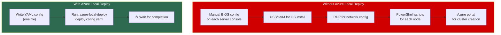

---

## Architecture Overview

The following diagram shows how the application connects to your infrastructure:

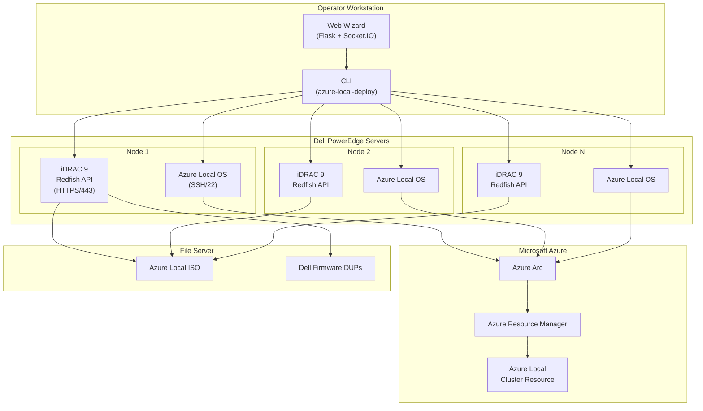

### Component interaction

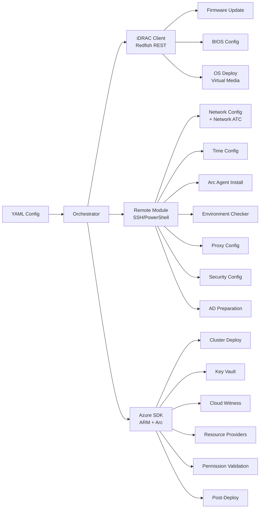

---

## Pipeline Stages

The deployment pipeline consists of 17 stages executed in order across four phases. Each stage can be run independently or as part of the full pipeline.

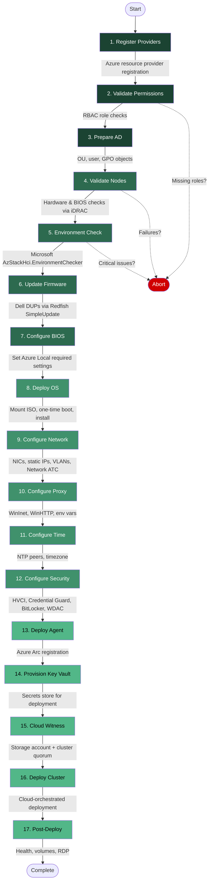

### Phase 1 — Azure & AD Preparation

| # | Stage | What It Does |
|---|---|---|
| 1 | **register_providers** | Registers the 11 required Azure resource providers (Microsoft.AzureStackHCI, Microsoft.KeyVault, Microsoft.HybridCompute, etc.) and optionally waits for each to reach `Registered` state. |
| 2 | **validate_permissions** | Checks the current identity's RBAC role assignments at subscription and resource-group scope against the roles required by Azure Local (Contributor, User Access Administrator, Key Vault Secrets User, etc.). Aborts if critical roles are missing. |
| 3 | **prepare_ad** | SSHes to a domain controller and runs the `AsHciADArtifactsPreCreationTool` to pre-create the OU, deployment user, and GPO block-inheritance objects required by cloud deployment. Supports `--verify-only` mode. |

### Phase 2 — Validation & Server Prep

| # | Stage | What It Does |
|---|---|---|
| 4 | **validate_nodes** | Connects to each iDRAC via Redfish and validates CPU (64-bit Intel/AMD), RAM (minimum 32 GB), storage (at least 2 disks, no RAID), TPM 2.0, Secure Boot, UEFI boot mode, SR-IOV, network adapters, SSH connectivity, reserved IP range conflicts (Kubernetes CIDRs), and DNS resolution for AD/Azure endpoints. |
| 5 | **environment_check** | SSHes into each node, installs Microsoft's `AzStackHci.EnvironmentChecker` PowerShell module, runs all 5 validators (Connectivity, Hardware, Active Directory, Network, Arc Integration), collects results, and then uninstalls the module (required before deployment). |
| 6 | **update_firmware** | Applies Dell firmware updates (BIOS, iDRAC, NIC, RAID, Disk controllers) using the Redfish `SimpleUpdate` action with individual Dell Update Packages (DUPs), or via the Dell Repository Manager catalog for bulk updates. Waits for each task to complete and reboots when required. |
| 7 | **configure_bios** | Reads current BIOS attributes from the server, compares against Azure Local requirements (VT-x, VT-d, SR-IOV, Secure Boot, UEFI, TPM 2.0, Memory Optimizer Mode, Hyper-Threading, etc.), patches only the mismatched settings, creates a BIOS config job, and reboots to apply. |

### Phase 3 — OS & Node Configuration

| # | Stage | What It Does |
|---|---|---|
| 8 | **deploy_os** | Mounts the Azure Local OS ISO as virtual media via iDRAC Redfish, sets one-time boot from virtual CD, powers on the server, and waits for the OS to install and SSH to become reachable. |
| 9 | **configure_network** | Renames physical NICs by MAC address to match your naming convention (e.g., Mgmt, Storage1, Storage2), assigns static IP addresses, sets DNS servers, configures VLANs, and verifies gateway connectivity. Optionally configures **Network ATC** intents for management, compute, and storage traffic types. |
| 10 | **configure_proxy** | Configures proxy settings consistently across all three Windows layers: WinInet (registry), WinHTTP (`netsh winhttp`), and machine-level environment variables. Automatically adds bypass entries for localhost, node IPs, and `*.local`. |
| 11 | **configure_time** | Configures Windows Time Service (`w32tm`) with your NTP servers and optionally sets the timezone on each node. |
| 12 | **configure_security** | Applies the Azure Local security baseline: HVCI, DRTM, Credential Guard, SMB signing/encryption, side-channel mitigations, BitLocker (boot + data), WDAC, and drift control. Uses `Recommended` (all on) or `Customized` profiles. |
| 13 | **deploy_agent** | Installs the Azure Connected Machine agent on each node and registers it with Azure Arc, linking the physical server to your Azure subscription and resource group. |

### Phase 4 — Cluster Deployment & Post-Deploy

| # | Stage | What It Does |
|---|---|---|
| 14 | **provision_keyvault** | Creates (or validates) an Azure Key Vault with soft-delete and public-network access, used by the cloud deployment engine to store secrets during provisioning. |
| 15 | **cloud_witness** | Creates a Standard_LRS Azure Storage account, retrieves its access key, and configures the Windows Failover Cluster quorum as a cloud witness (`Set-ClusterQuorum -CloudWitness`). |
| 16 | **deploy_cluster** | Creates the Azure Local cluster resource in Azure Resource Manager and triggers the cloud-orchestrated deployment. Polls the deployment status until completion (configurable timeout, default 2 hours). |
| 17 | **post_deploy** | Verifies Azure resource provisioning state, enables health monitoring (Azure Monitor Agent), creates workload storage volumes with automatic resiliency selection, and optionally enables RDP via `Enable-ASRemoteDesktop`. |

---

## Deployment Flow

The following sequence diagram shows the interaction between components during a typical deployment:

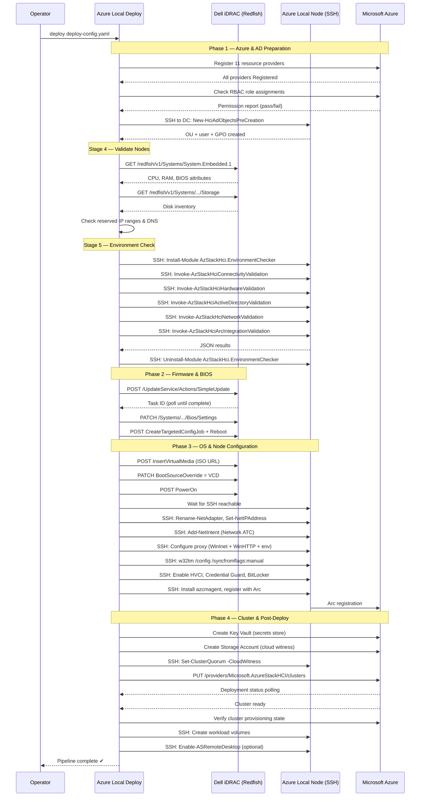

---

## Prerequisites

Before using this application, ensure the following requirements are met:

| Requirement | Details |
|---|---|
| **Python** | 3.10 or later. Required on the operator workstation only (not on the servers). |
| **Network Access** | The workstation must be able to reach every Dell iDRAC on HTTPS/443 and every node OS on SSH/22. |
| **Azure Local ISO** | The OS installation ISO must be hosted on an HTTP, HTTPS, NFS, or CIFS file server accessible from each iDRAC's management network. |
| **Azure Credentials** | A service principal or interactive login with the required RBAC roles (see Authentication section). Use `azure-local-deploy check-permissions` to validate. |
| **Azure Resource Providers** | The 11 required resource providers must be registered. Use `azure-local-deploy check-providers` to check and register. |
| **Dell iDRAC** | iDRAC 9 or later with Redfish enabled and a virtual-media license (Enterprise or Datacenter license). |
| **Dell Firmware** | (Optional) Dell Update Packages (DUPs) or a Dell Repository catalog URL for firmware updates. |
| **Active Directory** | (Optional) If using domain-joined deployment, run `azure-local-deploy prepare-ad` to pre-create the OU, deployment user, and GPO objects. |
| **DNS** | Forward and reverse DNS entries for each node's management IP. The DNS server must resolve the Active Directory domain. |

### Network requirements diagram

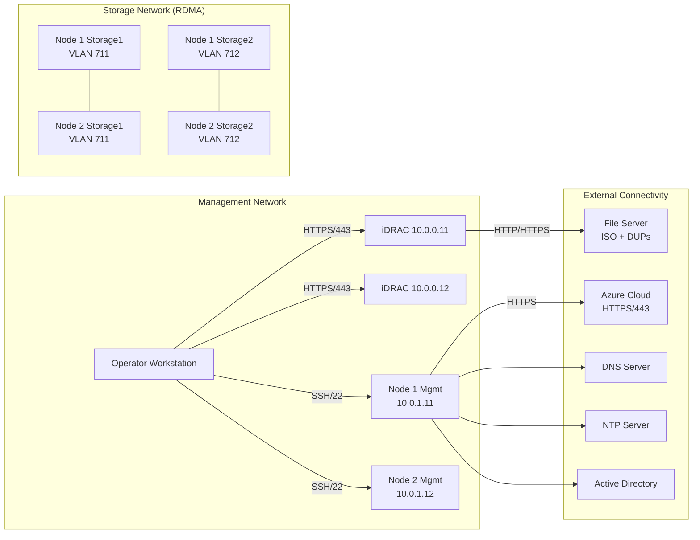

---

## Installation

### Option 1: Install from source (recommended for development)

```bash
# Clone the repository
git clone https://github.com/your-org/azure-local-deploy-app.git
cd azure-local-deploy-app

# Create a virtual environment (recommended)
python -m venv .venv

# Activate the virtual environment
# Windows PowerShell:
.venv\Scripts\Activate.ps1
# Linux / macOS:
source .venv/bin/activate

# Install in editable mode with dev dependencies
python -m pip install -e ".[dev]"
```

### Option 2: Install as a package

```bash
python -m pip install azure-local-deploy
```

### Verify installation

```bash
azure-local-deploy --version
azure-local-deploy --help
```

The CLI should display the version number and a list of available commands including `deploy`, `add-node`, `validate`, `preflight`, `env-check`, `check-docs`, `list-stages`, `web`, `check-providers`, `check-permissions`, `prepare-ad`, `configure-security`, `provision-keyvault`, `cloud-witness`, and `post-deploy`.

---

## Configuration

All deployment parameters are defined in a single YAML configuration file. A fully commented sample is provided at [`deploy-config.sample.yaml`](deploy-config.sample.yaml).

### Step 1: Copy the sample

```bash
cp deploy-config.sample.yaml deploy-config.yaml
```

### Step 2: Fill in your values

The configuration file has the following sections:

```mermaid
graph TD
    CONFIG[deploy-config.yaml] --> GLOBAL[global<br/>ISO URL, NTP, timezone,<br/>proxy, validation flags]
    CONFIG --> FW[firmware<br/>Catalog URL or DUP targets,<br/>reboot, timeout]
    CONFIG --> BIOS_SEC[bios<br/>Profile name, attribute<br/>overrides, reboot, timeout]
    CONFIG --> ENV[environment_checker<br/>Validators, timeouts,<br/>auto-uninstall]
    CONFIG --> AZ[azure<br/>Tenant, subscription,<br/>resource group, region]
    CONFIG --> CLUSTER[cluster<br/>Name, IP, domain FQDN,<br/>OU path, storage networks]
    CONFIG --> SERVERS[servers<br/>Per-node: iDRAC creds,<br/>host IP, NICs, SSH port]
    CONFIG --> ADC[active_directory<br/>DC host, OU, deployment user,<br/>GPO block inheritance]
    CONFIG --> SEC[security<br/>HVCI, Credential Guard,<br/>BitLocker, WDAC, drift]
    CONFIG --> KV[keyvault<br/>Vault name, region]
    CONFIG --> CW[cloud_witness<br/>Storage account name]
    CONFIG --> PROXY[proxy<br/>HTTP/S proxy, bypass list]
    CONFIG --> PD[post_deploy<br/>Health, volumes, RDP]

    style CONFIG fill:#264653,color:#fff
    style GLOBAL fill:#2a9d8f,color:#fff
    style FW fill:#2a9d8f,color:#fff
    style BIOS_SEC fill:#2a9d8f,color:#fff
    style ENV fill:#2a9d8f,color:#fff
    style AZ fill:#e9c46a,color:#000
    style CLUSTER fill:#e9c46a,color:#000
    style SERVERS fill:#f4a261,color:#000
    style ADC fill:#1b4332,color:#fff
    style SEC fill:#40916c,color:#fff
    style KV fill:#52b788,color:#000
    style CW fill:#52b788,color:#000
    style PROXY fill:#40916c,color:#fff
    style PD fill:#52b788,color:#000
```

### Configuration reference

| Section | Key | Required | Description |
|---|---|---|---|
| `global` | `iso_url` | Yes | HTTP/NFS/CIFS URL to the Azure Local ISO image |
| `global` | `ntp_servers` | No | List of NTP server hostnames (default: `time.windows.com`) |
| `global` | `timezone` | No | Windows timezone ID (default: `UTC`) |
| `global` | `check_docs` | No | Fetch latest Microsoft docs before deploy (default: `true`) |
| `global` | `abort_on_validation_failure` | No | Stop pipeline if pre-flight checks fail (default: `true`) |
| `global` | `sbe_source` | No | UNC path or local path to Solution Builder Extension package for SBE copy to new nodes |
| `firmware` | `catalog_url` | No | Dell Repository catalog URL for bulk firmware updates |
| `firmware` | `targets` | No | List of individual DUPs with component, URL, version, install option |
| `firmware` | `apply_reboot` | No | Reboot after firmware updates (default: `true`) |
| `bios` | `profile` | No | Profile name, informational (default: `AzureLocal`) |
| `bios` | `attributes` | No | Override specific BIOS attributes on top of Azure Local defaults |
| `environment_checker` | `validators` | No | List of validators to run, or `null` for all 5 |
| `environment_checker` | `auto_uninstall` | No | Remove the module after checks (default: `true`, Microsoft requires this) |
| `azure` | `tenant_id` | Yes | Azure AD tenant ID |
| `azure` | `subscription_id` | Yes | Azure subscription ID |
| `azure` | `resource_group` | Yes | Target resource group (must exist) |
| `azure` | `region` | Yes | Azure region (e.g., `eastus`, `westeurope`) |
| `cluster` | `name` | Yes | Desired cluster name |
| `cluster` | `cluster_ip` | Yes | Static IP for the Windows Failover Cluster |
| `cluster` | `domain_fqdn` | No | Active Directory domain FQDN (blank for AD-less) |
| `servers[*]` | `idrac_host` | Yes | iDRAC IP address or hostname |
| `servers[*]` | `idrac_user` | Yes | iDRAC username (typically `root`) |
| `servers[*]` | `idrac_password` | Yes | iDRAC password |
| `servers[*]` | `host_ip` | Yes | Management IP address for the node OS |
| `servers[*]` | `hostname` | No | Desired Windows hostname for the node (used during OS preparation) |
| `servers[*]` | `nics` | Yes | List of NIC definitions (name, MAC, IP, prefix, gateway, DNS, VLAN) |
| `active_directory` | `dc_host` | No | Domain controller IP or hostname (SSH target for AD prep) |
| `active_directory` | `ou_name` | No | OU name to create (e.g., `AzureLocal`) |
| `active_directory` | `deployment_user` | No | sAMAccountName for the deployment user |
| `active_directory` | `deployment_password` | No | Password for the deployment user |
| `active_directory` | `domain_fqdn` | No | Fully qualified domain name |
| `active_directory` | `block_inheritance` | No | Block GPO inheritance on the OU (default: `true`) |
| `security` | `profile` | No | `recommended` (all on) or `customized` (default: `recommended`) |
| `security` | `hvci` | No | Enable Hypervisor-protected Code Integrity (default: `true`) |
| `security` | `credential_guard` | No | Enable Windows Credential Guard (default: `true`) |
| `security` | `smb_signing` | No | Require SMB signing (default: `true`) |
| `security` | `smb_encryption` | No | Require SMB encryption (default: `true`) |
| `security` | `bitlocker_boot` | No | Enable BitLocker on boot volume (default: `true`) |
| `security` | `bitlocker_data` | No | Enable BitLocker on data volumes (default: `true`) |
| `security` | `wdac` | No | Enable Windows Defender Application Control (default: `true`) |
| `security` | `drift_control` | No | Enable security settings drift control (default: `true`) |
| `keyvault` | `vault_name` | No | Azure Key Vault name (auto-generated if omitted) |
| `cloud_witness` | `storage_account_name` | No | Storage account name for cloud witness (auto-generated if omitted) |
| `proxy` | `http_proxy` | No | HTTP proxy URL (e.g., `http://proxy.corp.com:8080`) |
| `proxy` | `https_proxy` | No | HTTPS proxy URL |
| `proxy` | `no_proxy` | No | Bypass list (comma-separated hosts/CIDRs) |
| `post_deploy` | `enable_health_monitoring` | No | Enable Azure Monitor Agent (default: `true`) |
| `post_deploy` | `create_volumes` | No | Create workload storage volumes (default: `true`) |
| `post_deploy` | `enable_rdp` | No | Enable RDP via `Enable-ASRemoteDesktop` (default: `false`) |
| `add_node` | `existing_cluster_name` | Yes* | Name of the existing Azure Local cluster (*required for add-node mode) |
| `add_node` | `existing_cluster_resource_group` | No | Resource group of the existing cluster (defaults to `azure.resource_group`) |
| `add_node.existing_node` | `host` | Yes* | IP address of an existing cluster node (SSH target for pre/post-add operations) |
| `add_node.existing_node` | `user` | No | SSH username for existing node (default: `Administrator`) |
| `add_node.existing_node` | `password` | Yes* | SSH password for existing node |
| `add_node.existing_node` | `ssh_port` | No | SSH port for existing node (default: `22`) |
| `day2_services` | `custom_location_name` | No | Azure custom location name for MOC resources |
| `day2_services.logical_networks[*]` | `name` | Yes | Logical network display name |
| `day2_services.logical_networks[*]` | `address_type` | Yes | `DHCP` or `Static` |
| `day2_services.logical_networks[*]` | `vm_switch_name` | Yes | Hyper-V virtual switch name |
| `day2_services.logical_networks[*]` | `address_prefix` | Static | CIDR prefix (e.g., `192.168.200.0/24`) |
| `day2_services.logical_networks[*]` | `gateway` | Static | Default gateway address |
| `day2_services.logical_networks[*]` | `dns_servers` | Static | List of DNS server IPs |
| `day2_services.logical_networks[*]` | `ip_pool_start` | Static | First IP in the allocation pool |
| `day2_services.logical_networks[*]` | `ip_pool_end` | Static | Last IP in the allocation pool |
| `day2_services.logical_networks[*]` | `vlan_id` | No | Optional VLAN tag |
| `day2_services.vm_images[*]` | `name` | Yes | Gallery image display name |
| `day2_services.vm_images[*]` | `image_path` | Yes | UNC path or HTTP URL to VHDX file |
| `day2_services.vm_images[*]` | `os_type` | Yes | `Windows` or `Linux` |
| `day2_services.test_vms[*]` | `name` | Yes | Virtual machine name |
| `day2_services.test_vms[*]` | `logical_network` | Yes | Name of the logical network to attach |
| `day2_services.test_vms[*]` | `image_name` | Yes | Name of the gallery image to use |
| `day2_services.test_vms[*]` | `cpu_count` | No | Number of vCPUs (default: `4`) |
| `day2_services.test_vms[*]` | `memory_gb` | No | RAM in GB (default: `8`) |
| `day2_services.test_vms[*]` | `storage_gb` | No | Disk size in GB (default: `128`) |
| `day2_services.test_vms[*]` | `admin_username` | Yes | VM local admin username |
| `day2_services.test_vms[*]` | `admin_password` | Yes | VM local admin password |

### Step 3: Validate the configuration

```bash
azure-local-deploy validate deploy-config.yaml
```

This parses the YAML, checks required keys, and reports any structural errors without touching any servers.

---

## How to Use — CLI

The application is invoked through the `azure-local-deploy` command. Below is a complete guide to every available command.

### Full deployment

Run all 17 stages in sequence on every server defined in the config:

```bash
azure-local-deploy deploy deploy-config.yaml
```

### Selective stage execution

Run only specific stages. This is useful when resuming after a failure or when you need to re-run a particular step:

```bash
# Run only firmware update and BIOS configuration
azure-local-deploy deploy deploy-config.yaml --stage update_firmware --stage configure_bios

# Run only OS deployment
azure-local-deploy deploy deploy-config.yaml --stage deploy_os

# Run only network + time + agent (post-OS stages)
azure-local-deploy deploy deploy-config.yaml -s configure_network -s configure_time -s deploy_agent
```

### Dry run

See what the pipeline would do without making any changes:

```bash
azure-local-deploy deploy deploy-config.yaml --dry-run
```

### Pre-flight validation

Run hardware and BIOS checks without proceeding to deployment:

```bash
# Abort on any failures (default)
azure-local-deploy preflight deploy-config.yaml

# Report only — don't abort
azure-local-deploy preflight deploy-config.yaml --no-abort
```

### Microsoft Environment Checker

Run the official AzStackHci.EnvironmentChecker on all nodes:

```bash
# Run all 5 validators
azure-local-deploy env-check deploy-config.yaml

# Run specific validators only
azure-local-deploy env-check deploy-config.yaml -v Connectivity -v Hardware

# Report only — don't abort on critical failures
azure-local-deploy env-check deploy-config.yaml --no-abort
```

### Check Azure Local documentation

Fetch the latest Microsoft docs and display current requirements:

```bash
azure-local-deploy check-docs
```

### List available stages

```bash
azure-local-deploy list-stages
```

### Check Azure resource providers

Verify that all 11 required resource providers are registered in the target subscription:

```bash
azure-local-deploy check-providers deploy-config.yaml
```

### Validate RBAC permissions

Check that the current Azure identity has the required role assignments:

```bash
azure-local-deploy check-permissions deploy-config.yaml
```

### Prepare Active Directory

Pre-create AD objects (OU, deployment user, GPO block) on a domain controller:

```bash
# Full preparation
azure-local-deploy prepare-ad deploy-config.yaml

# Verify-only (no changes)
azure-local-deploy prepare-ad deploy-config.yaml --verify-only
```

### Configure security

Apply the Azure Local security baseline to all nodes:

```bash
# Apply recommended profile (all hardening enabled)
azure-local-deploy configure-security deploy-config.yaml

# Apply customized profile
azure-local-deploy configure-security deploy-config.yaml --profile customized

# Check-only (audit current state)
azure-local-deploy configure-security deploy-config.yaml --check-only
```

### Provision Key Vault

Create the Azure Key Vault used by cloud deployment:

```bash
azure-local-deploy provision-keyvault deploy-config.yaml

# With explicit vault name
azure-local-deploy provision-keyvault deploy-config.yaml --vault-name my-hci-vault
```

### Configure cloud witness

Create a storage account and configure the cluster quorum:

```bash
azure-local-deploy cloud-witness deploy-config.yaml

# With explicit storage account name
azure-local-deploy cloud-witness deploy-config.yaml --storage-account hciwitness01
```

### Post-deployment tasks

Run post-deployment validation and configuration:

```bash
# All post-deploy tasks
azure-local-deploy post-deploy deploy-config.yaml

# Enable RDP
azure-local-deploy post-deploy deploy-config.yaml --enable-rdp

# Skip volume creation
azure-local-deploy post-deploy deploy-config.yaml --skip-volumes
```

### CLI command summary

```mermaid
graph TD
    CLI[azure-local-deploy] --> DEPLOY[deploy<br/>Run full or partial pipeline]
    CLI --> ADDNODE[add-node<br/>Add server to existing cluster]
    CLI --> VALIDATE[validate<br/>Check config file syntax]
    CLI --> PREFLIGHT[preflight<br/>Hardware & BIOS validation]
    CLI --> ENVCHECK[env-check<br/>Microsoft Environment Checker]
    CLI --> CHECKDOCS[check-docs<br/>Fetch latest MS docs]
    CLI --> LISTSTAGES[list-stages<br/>Show available stages]
    CLI --> WEB_CMD[web<br/>Launch web wizard]
    CLI --> CHKPROV[check-providers<br/>Resource provider status]
    CLI --> CHKPERM[check-permissions<br/>RBAC role validation]
    CLI --> PREPAD[prepare-ad<br/>AD object preparation]
    CLI --> CFGSEC[configure-security<br/>Security baseline]
    CLI --> PROVKV[provision-keyvault<br/>Create Key Vault]
    CLI --> CLOUDW[cloud-witness<br/>Storage account + quorum]
    CLI --> POSTD[post-deploy<br/>Health, volumes, RDP]
    CLI --> DAY2[day2<br/>Provision networks, images, VMs]
    CLI --> LSTD2[list-day2<br/>Show Day 2 resources]

    DEPLOY --> |--stage| SELECTIVE[Run specific stages]
    DEPLOY --> |--dry-run| DRY[Preview without executing]
    ENVCHECK --> |-v| SUBSET[Specific validators]
    CFGSEC --> |--profile| PROFILE[recommended / customized]
    PREPAD --> |--verify-only| VERIFY[Audit without changes]
    WEB_CMD --> |--port| PORT[Custom port]

    style CLI fill:#264653,color:#fff
    style DEPLOY fill:#2a9d8f,color:#fff
    style ADDNODE fill:#2a9d8f,color:#fff
    style VALIDATE fill:#e9c46a,color:#000
    style PREFLIGHT fill:#e9c46a,color:#000
    style ENVCHECK fill:#e9c46a,color:#000
    style CHECKDOCS fill:#e76f51,color:#fff
    style LISTSTAGES fill:#e76f51,color:#fff
    style WEB_CMD fill:#f4a261,color:#000
    style CHKPROV fill:#1b4332,color:#fff
    style CHKPERM fill:#1b4332,color:#fff
    style PREPAD fill:#1b4332,color:#fff
    style CFGSEC fill:#40916c,color:#fff
    style PROVKV fill:#52b788,color:#000
    style CLOUDW fill:#52b788,color:#000
    style POSTD fill:#52b788,color:#000
    style DAY2 fill:#e76f51,color:#fff
    style LSTD2 fill:#e76f51,color:#fff
```

---

## How to Use — Web Wizard

For operators who prefer a graphical interface, the application includes a browser-based wizard built with Flask and Bootstrap 5 (dark theme). Real-time deployment progress is streamed using Socket.IO.

### Launch the wizard

```bash
# Default: http://localhost:5000
azure-local-deploy web

# Custom port
azure-local-deploy web --port 8080

# Debug mode (auto-reload on code changes)
azure-local-deploy web --debug
```

### Web wizard flow

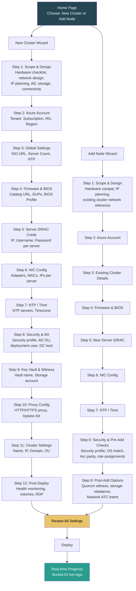

The wizard builds a YAML configuration from the form inputs and launches the deployment pipeline in a background thread. The progress page shows each stage's status with live log streaming. You can also download the generated YAML config from the progress page for future CLI use.

### Scope & Design step

The first step in both wizards is a comprehensive **Scope & Design** page based on the [Microsoft Azure Local deployment checklist](https://learn.microsoft.com/en-us/azure/azure-local/plan/deployment-checklist). It covers:

| New Cluster | Add Node |
|---|---|
| Deployment sizing (1–16 nodes) | Expansion type (scale-out / single→multi) |
| Hardware readiness checklist (CPU, RAM, disks, NIC, TPM, UEFI, iDRAC) | Hardware compatibility checklist (same model, firmware, NICs, drives) |
| Network design (management subnet, storage VLANs, RDMA, MTU) | Existing cluster network reference (matching subnets & VLANs) |
| IP address planning (cluster IP, infrastructure pool, per-node IPs) | New node IP planning (iDRAC, management, storage IPs) |
| Identity & AD (domain-joined vs AD-less, OU path) | Pre-expansion checklist (cluster health, DNS, switch ports) |
| Outbound connectivity (direct / proxy / private link) | |
| Storage design (NVMe / SSD, drive count, witness type) | |
| Summary checklist (hardware, network, DNS, firewall, Azure sub, ISO, iDRAC) | |

---

## Day 2 Services

Once your Azure Local cluster is deployed and operational, the next step is to make it useful — create the networking infrastructure for virtual machines, upload OS images, and provision test VMs to validate the platform. Azure Local Deploy includes a complete **Day 2 Services** workflow that handles all of this through the CLI, the web wizard, or the YAML config.

### What are Day 2 Services?

"Day 1" is getting the cluster running. "Day 2" is everything after: the operational tasks that turn a bare cluster into a platform ready to host workloads. The Day 2 Services workflow creates:

1. **Two logical networks** — A DHCP network (for VMs that get IP addresses from your existing DHCP server) and a Static IP network (for VMs that need predictable addresses from a defined IP pool).
2. **Two VM images** — Windows Server 2025 and Windows 11 Enterprise, uploaded from VHDX files so you can create VMs immediately.
3. **Two test VMs** — One running Windows Server 2025 on the DHCP network, one running Windows 11 on the static network, each with admin credentials you specify so you can log in and verify the environment.

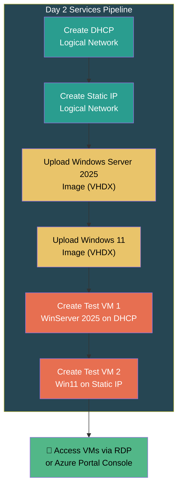

### Day 2 via CLI

Run all Day 2 tasks with a single command:

```bash
azure-local-deploy day2 deploy-config.yaml
```

Or skip specific sections:

```bash
# Skip network creation (already done)
azure-local-deploy day2 deploy-config.yaml --skip-networks

# Skip image upload (already uploaded)
azure-local-deploy day2 deploy-config.yaml --skip-images

# Skip VM creation
azure-local-deploy day2 deploy-config.yaml --skip-vms
```

List existing Day 2 resources:

```bash
azure-local-deploy list-day2 deploy-config.yaml
```

### Day 2 via Web Wizard

Choose **Day 2 Services** on the home page and follow the 3-step wizard:


### Day 2 YAML configuration

Add a `day2_services` section to your config file for full control over every parameter:

```yaml
day2_services:
  custom_location_name: "azlocal-cl-01-customlocation"

  logical_networks:
    # DHCP network — uses your existing DHCP server
    - name: "dhcp-logical-network"
      address_type: "DHCP"
      vm_switch_name: "ConvergedSwitch(compute_management)"

    # Static IP network — assigns IPs from a pool
    - name: "static-logical-network"
      address_type: "Static"
      address_prefix: "192.168.200.0/24"
      gateway: "192.168.200.1"
      dns_servers: ["192.168.200.1"]
      ip_pool_start: "192.168.200.100"
      ip_pool_end: "192.168.200.200"
      vm_switch_name: "ConvergedSwitch(compute_management)"

  vm_images:
    # Windows Server 2025 — Gen 2 VHDX
    - name: "windows-server-2025"
      image_path: "\\\\fileserver\\images\\ws2025-datacenter.vhdx"
      os_type: "Windows"

    # Windows 11 Enterprise — Gen 2 VHDX
    - name: "windows-11-enterprise"
      image_path: "\\\\fileserver\\images\\win11-enterprise-24h2.vhdx"
      os_type: "Windows"

  test_vms:
    # Test VM 1 — Windows Server 2025 on DHCP
    - name: "test-vm-winserver2025"
      logical_network: "dhcp-logical-network"
      image_name: "windows-server-2025"
      cpu_count: 4
      memory_gb: 8
      storage_gb: 128
      admin_username: "azurelocaladmin"
      admin_password: "P@ssw0rd!Change-Me-123"

    # Test VM 2 — Windows 11 on Static IP
    - name: "test-vm-win11"
      logical_network: "static-logical-network"
      image_name: "windows-11-enterprise"
      cpu_count: 4
      memory_gb: 8
      storage_gb: 128
      admin_username: "azurelocaladmin"
      admin_password: "P@ssw0rd!Change-Me-123"
```

### Logical network details

Azure Local uses **logical networks** to provide virtual networking for VMs. Each logical network is backed by a Hyper-V virtual switch (typically the converged switch created during cluster deployment) and can be configured for DHCP or static IP assignment.

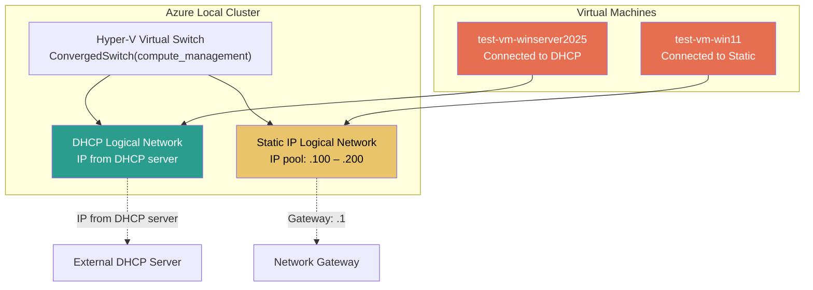

| Network Type | Use Case | IP Assignment | Requirements |
|---|---|---|---|
| **DHCP** | Development, lab, branch offices with existing DHCP infrastructure | Automatic from DHCP server | DHCP server on the physical network |
| **Static IP** | Production workloads, databases, services needing predictable IPs | From IP pool (start → end range) | Address prefix, gateway, DNS, IP pool range |

### Accessing the test VMs

After the VMs are created, you can access them using:

1. **RDP** — If RDP was enabled during post-deploy, open Remote Desktop Connection to the VM's IP address. Use the admin username and password from the config.
2. **Azure Portal** — Navigate to the VM resource in the Azure portal and use the **Connect** button for a browser-based console session.
3. **PowerShell** — SSH into a cluster node and use `vmconnect` or `Enter-PSSession` to the VM.

```
Username: azurelocaladmin
Password: (the password you set in the config)
```

---

## Add Node to Existing Cluster

Add one or more new Dell servers to an existing Azure Local cluster using a full **15-stage pipeline** aligned with the [Microsoft Add-Server documentation](https://learn.microsoft.com/en-us/azure/azure-local/manage/add-server).

### Via CLI

```bash
azure-local-deploy add-node add-node-config.yaml
```

The config file must include an `add_node` section:

```yaml
add_node:
  existing_cluster_name: "azlocal-cluster-01"
  existing_cluster_resource_group: "rg-azurelocal-prod"
  existing_node:
    host: "10.0.0.11"         # IP of an existing cluster node (SSH target)
    user: "Administrator"
    password: "P@ssw0rd!"
    ssh_port: 22

global:
  sbe_source: "\\\\fileserver\\sbe"   # Solution Builder Extension package
  hostname: "node03"                    # Hostname for the new node

servers:
  - idrac_host: "10.0.0.103"
    idrac_user: "root"
    idrac_password: "calvin"
    host_ip: "10.0.0.13"
    hostname: "node03"
    nics: [...]
```

### Via Web Wizard

Choose "Add Node to Existing Cluster" on the home page of the web wizard and follow the 9-step wizard.

### Add-node pipeline stages (15 stages)

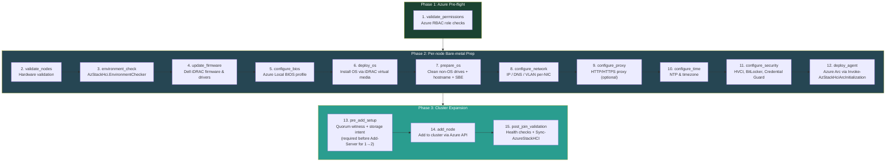

| # | Stage | Description |
|---|---|---|
| 1 | `validate_permissions` | Checks Azure RBAC roles (Azure Stack HCI Admin, Contributor, etc.) |
| 2 | `validate_nodes` | Pre-flight hardware validation via iDRAC (CPU, memory, drives, TPM) |
| 3 | `environment_check` | Runs Microsoft `AzStackHci.EnvironmentChecker` (connectivity, hardware, AD, network, Arc) |
| 4 | `update_firmware` | Applies Dell firmware and driver updates via iDRAC Redfish |
| 5 | `configure_bios` | Sets Azure Local BIOS profile (VT-x, SR-IOV, Secure Boot, TPM, etc.) |
| 6 | `deploy_os` | Installs Azure Stack HCI OS via iDRAC virtual media mount |
| 7 | `prepare_os` | **New:** Cleans all non-OS drives (`Clear-Disk`), sets hostname, copies Solution Builder Extension (SBE) to `C:\SBE` |
| 8 | `configure_network` | Configures static IP, DNS, VLAN per-NIC (SConfig equivalent) |
| 9 | `configure_proxy` | Sets HTTP/HTTPS proxy across WinInet, WinHTTP, env vars (optional) |
| 10 | `configure_time` | Configures NTP servers and timezone (w32tm) |
| 11 | `configure_security` | Applies security baseline: HVCI, Credential Guard, BitLocker, SMB, WDAC, drift control |
| 12 | `deploy_agent` | Registers node with Azure Arc using `Invoke-AzStackHciArcInitialization` (Microsoft recommended). Falls back to raw `azcmagent connect` if needed. |
| 13 | `pre_add_setup` | **New:** Configures quorum witness and storage Network ATC intent on the *existing* cluster. Required before `Add-Server` when expanding from 1→2 nodes. |
| 14 | `add_node` | Adds the node to the cluster via Azure API (`Add-Server` / ARM). Validates OS version match, Arc parity, and role assignments before calling the API. |
| 15 | `post_join_validation` | Runs 7 post-join checks (node joined, storage healthy, network up, Arc status, cluster health, storage rebalance). Calls `Sync-AzureStackHCI` to force Azure portal sync. |

### Key add-node features

- **OS drive cleaning** — Microsoft requires all non-OS drives to be wiped before deployment. Stage 7 runs `Clear-Disk -RemoveData -RemoveOEM` on every non-boot disk.
- **SBE deployment** — Copies the Solution Builder Extension package to `C:\SBE` on the new node (configured via `global.sbe_source`).
- **Invoke-AzStackHciArcInitialization** — Stage 12 uses Microsoft's recommended cmdlet (installs the Az.StackHCI module, then runs the initialization). This replaces the older raw `azcmagent connect` approach.
- **Pre-add quorum & storage intent** — When expanding from 1 node to 2, the quorum witness and storage intent must be configured *before* adding the second node. Stage 13 handles this automatically.
- **Post-join Sync** — Stage 15 runs `Sync-AzureStackHCI` to ensure the expanded cluster appears correctly in the Azure portal immediately.

---

## Rebuild Cluster

The rebuild workflow is a **14-stage pipeline** that fully rebuilds an Azure Local cluster while preserving workloads. This is useful for hardware refresh, major OS upgrades, or disaster recovery scenarios where the cluster infrastructure needs to be rebuilt from scratch.

### Via CLI

```bash
azure-local-deploy rebuild deploy-config.yaml
```

### Via Web Wizard

Choose "Rebuild Cluster" on the home page of the web wizard and follow the 7-step wizard.

### Rebuild pipeline stages

| # | Stage | Description |
|---|---|---|
| 1 | `discovery` | Inventory all VMs, storage, and network resources on the cluster |
| 2 | `dependency_mapping` | Map inter-VM dependencies (shared disks, affinity rules, network links) |
| 3 | `ai_planning` | AI-assisted migration planning — generates optimal evacuation waves |
| 4 | `backup_vms` | Backup all VM configurations, VHDX files, and metadata |
| 5 | `pre_migration_validation` | Validate migration targets, storage capacity, and network connectivity |
| 6 | `evacuate_workloads` | Live-migrate or save-state VMs off the cluster in planned waves |
| 7 | `verify_evacuation` | Confirm all workloads are safely evacuated and backed up |
| 8 | `cluster_teardown` | Tear down the existing cluster infrastructure |
| 9 | `cluster_rebuild` | Rebuild the cluster using the new-cluster pipeline (hydration) |
| 10 | `day2_restore` | Restore Day 2 resources (logical networks, images, custom locations) |
| 11 | `move_back_workloads` | Migrate workloads back to the rebuilt cluster |
| 12 | `post_move_validation` | Validate all VMs are running, healthy, and accessible |
| 13 | `verify_backups` | Verify backup integrity before cleanup |
| 14 | `cleanup` | Remove temporary backup files and migration artifacts |

Key features: checkpoint/resume support (persists state to `~/.azure-local-deploy/`), PowerShell injection prevention via `_ps_escape()`, and AI-assisted migration wave planning.

See [designs/rebuild-cluster-module.md](designs/rebuild-cluster-module.md) for the full design document.

---

## Environment Checker

The application integrates Microsoft's official **AzStackHci.EnvironmentChecker** — a PowerShell module that validates your infrastructure readiness across five dimensions:

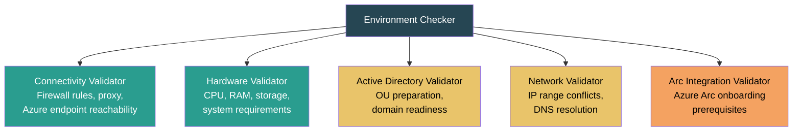

### How it works

1. The app SSHes into each node and installs `AzStackHci.EnvironmentChecker` from the PowerShell Gallery.
2. Each validator is executed with `-PassThru` to return structured JSON results.
3. Results are parsed, categorized (Critical / Warning / Informational / Pass), and displayed.
4. The module is **automatically uninstalled** after checks — Microsoft requires this to avoid conflicts with the copy that ships inside Azure Local.

### Configuration

In `deploy-config.yaml`:

```yaml
environment_checker:
  # Run a subset of validators (null = all 5)
  validators: null
  install_timeout: 300
  validator_timeout: 600
  auto_uninstall: true
```

---

## BIOS Settings Reference

The `configure_bios` stage sets the following Dell PowerEdge BIOS attributes to meet Azure Local requirements. These are applied automatically and only changed settings trigger a reboot.

| Attribute | Value | Purpose |
|---|---|---|
| `ProcVirtualization` | Enabled | Intel VT-x / AMD-V for Hyper-V |
| `ProcVtd` | Enabled | Intel VT-d / AMD IOMMU for device passthrough |
| `SriovGlobalEnable` | Enabled | SR-IOV for high-performance networking |
| `SecureBoot` | Enabled | Secure Boot requirement for Azure Local |
| `BootMode` | Uefi | UEFI boot (required, Legacy not supported) |
| `TpmSecurity` | OnPbm | TPM 2.0 with Pre-boot Measurement |
| `MemOpMode` | OptimizerMode | Memory performance optimization |
| `LogicalProc` | Enabled | Hyper-Threading for better VM density |
| `ProcCStates` | Disabled | Reduces latency for storage workloads |
| `SysProfile` | PerfPerWattOptimizedDapc | Balanced performance and power |
| `NodeInterleave` | Disabled | NUMA-aware memory allocation |
| `EmbSata` | AhciMode | Required SATA mode |

You can override any of these in the config:

```yaml
bios:
  attributes:
    SysProfile: "PerfOptimized"    # Maximum performance
    ProcCStates: "Enabled"          # Allow C-states for power saving
```

---

## Project Layout

```
azure-local-deploy-app/
├── pyproject.toml                    # Build config, dependencies, CLI entry point
├── deploy-config.sample.yaml         # Fully commented configuration template
├── README.md                         # This file
├── designs/                          # Design documents
│   └── rebuild-cluster-module.md     # Rebuild cluster module design
├── tests/                            # Unit tests
│   ├── test_idrac_client.py
│   ├── test_config.py
│   ├── test_web_wizard.py
│   ├── test_firmware.py
│   ├── test_bios.py
│   ├── test_validation.py
│   ├── test_docs_checker.py
│   ├── test_environment_checker.py
│   └── test_phase_enhancements.py    # Tests for all Phase 1–4 modules
└── src/azure_local_deploy/
    ├── cli.py                        # Click CLI — 17+ commands
    ├── orchestrator.py               # New-cluster pipeline controller — 17 stages
    ├── web_app.py                    # Flask web wizard + Socket.IO (production hardened)
    ├── auth.py                       # JWT authentication for web API
    ├── api.py                        # REST API endpoints with rate limiting & security headers
    ├── api_client.py                 # Python client for the REST API
    ├── add_node.py                   # 15-stage add-node pipeline (MS docs aligned)
    ├── rebuild.py                    # Full cluster rebuild pipeline (with PS injection prevention)
    ├── models.py                     # Shared data models
    ├── ai_provider.py                # AI/LLM integration provider
    ├── idrac_client.py               # Dell iDRAC Redfish REST client
    ├── update_firmware.py            # Firmware update via SimpleUpdate / Repository
    ├── configure_bios.py             # BIOS configuration with Azure Local defaults
    ├── validate_nodes.py             # Pre-flight validation (+ reserved IP & DNS checks)
    ├── environment_checker.py        # Microsoft AzStackHci.EnvironmentChecker
    ├── docs_checker.py               # Online documentation requirements checker
    ├── deploy_os.py                  # OS image deployment via virtual media
    ├── configure_network.py          # NIC rename, static IP, VLAN, Network ATC intents
    ├── configure_time.py             # NTP and timezone setup
    ├── deploy_agent.py               # Azure Arc agent — Invoke-AzStackHciArcInitialization (default) or raw azcmagent
    ├── deploy_cluster.py             # Cluster creation via Azure SDK
    ├── register_providers.py         # Azure resource provider registration (Phase 1)
    ├── validate_permissions.py       # RBAC role assignment validation (Phase 1)
    ├── prepare_ad.py                 # Active Directory preparation (Phase 1)
    ├── configure_proxy.py            # Proxy config — WinInet, WinHTTP, env (Phase 3)
    ├── configure_security.py         # Security baseline — HVCI, BitLocker, WDAC (Phase 3)
    ├── provision_keyvault.py         # Azure Key Vault provisioning (Phase 4)
    ├── cloud_witness.py              # Cloud witness — storage account + quorum (Phase 4)
    ├── post_deploy.py                # Post-deploy — health, volumes, RDP (Phase 4)
    ├── day2_services.py              # Day 2 — logical networks, images, VMs
    ├── remote.py                     # SSH / PowerShell remote execution (hardened)
    ├── utils.py                      # Logging, retry decorator, validation helpers
    └── templates/                    # Jinja2 HTML templates (Bootstrap 5 dark theme)
        ├── base.html                 # Base layout with nav, CSS, JS
        ├── index.html                # Home page — choose wizard mode
        ├── wizard_sidebar.html       # Sidebar navigation for wizard steps
        ├── wizard_new_cluster_step[1-12].html
        ├── wizard_add_node_step[1-9].html
        ├── wizard_rebuild_step[1-7].html  # Rebuild cluster wizard
        ├── wizard_day2_step[1-3].html  # Day 2 wizard — networks, images, VMs
        ├── wizard_day2_results.html   # Day 2 results and VM credentials
        ├── wizard_review.html        # Review all settings before deploy
        └── wizard_progress.html      # Real-time progress with Socket.IO
```

---

## Authentication

### Azure credentials

The cluster-deployment and Arc agent stages use `DefaultAzureCredential` from the Azure Identity SDK. It tries these methods in order:

1. **Environment variables** — `AZURE_CLIENT_ID`, `AZURE_TENANT_ID`, `AZURE_CLIENT_SECRET` (best for CI/CD)
2. **Azure CLI** — `az login` (best for interactive use)
3. **Managed Identity** — When running on an Azure VM (best for production automation)

The service principal or user account needs these roles at the **subscription** level:
- **Azure Stack HCI Administrator**
- **Reader**

And these roles at the **resource group** level:
- **Contributor**
- **User Access Administrator** (for Arc registration and role assignments)
- **Key Vault Data Access Administrator**
- **Key Vault Secrets Officer**
- **Key Vault Contributor**
- **Storage Account Contributor**

For Arc registration, the identity also needs:
- **Azure Connected Machine Resource Manager**
- **Azure Connected Machine Onboarding**

Use `azure-local-deploy check-permissions deploy-config.yaml` to validate all required roles before starting deployment.

### iDRAC credentials

Specified per-server in the YAML config file. For security you can also use environment variables:

```bash
export ALD_IDRAC_PASSWORD="your-idrac-password"
```

### Host OS credentials

The `host_user` and `host_password` fields are used for SSH connections to the Azure Local OS after installation.

---

## Troubleshooting

### Common issues

| Problem | Solution |
|---|---|
| **iDRAC connection refused** | Verify iDRAC IP is reachable (ping), Redfish is enabled in iDRAC settings, and HTTPS/443 is not blocked by firewall. |
| **Virtual media mount fails** | Ensure the ISO URL is reachable from the iDRAC management network (not from your workstation). Test by browsing the URL from the iDRAC web UI. |
| **SSH connection timeout** | The OS may not have finished installing. Increase `install_timeout`. |
| **BIOS settings not applying** | Some attributes have different names across Dell server generations (14G/15G/16G). Check the iDRAC Redfish BIOS attributes list for your model. |
| **Environment Checker install fails** | The node needs internet access to reach the PowerShell Gallery. Check proxy settings and firewall rules. |
| **Arc registration fails** | Verify the node has outbound HTTPS access to Azure Arc endpoints. Run `azure-local-deploy env-check` with the Connectivity validator. |
| **Cluster deployment timeout** | Cloud-orchestrated deployment can take 1–3 hours depending on cluster size. Increase `deployment_timeout` in the config. |
| **Resource providers not registered** | Run `azure-local-deploy check-providers deploy-config.yaml` to register all 11 required providers. Some providers can take several minutes to register. |
| **Permission check fails** | The identity needs specific roles at both subscription and resource-group scope. Run `azure-local-deploy check-permissions` to see which roles are missing, then assign them in the Azure portal. |
| **Key Vault creation fails** | Ensure the vault name is globally unique (3–24 chars, alphanumeric + hyphens). Check that the identity has Key Vault Contributor role. |
| **AD preparation fails** | Ensure the DC host is reachable via SSH and the credentials have domain admin privileges. Use `--verify-only` to check existing AD objects. |
| **BitLocker won't enable** | The node must have a TPM 2.0 chip and UEFI Secure Boot enabled. Run `azure-local-deploy configure-security --check-only` to audit. |

### Debugging tips

```bash
# Run with verbose logging
azure-local-deploy deploy deploy-config.yaml 2>&1 | tee deploy.log

# Run a single stage to isolate the problem
azure-local-deploy deploy deploy-config.yaml --stage configure_network

# Check hardware readiness without deploying
azure-local-deploy preflight deploy-config.yaml --no-abort

# Validate environment with Microsoft's tool
azure-local-deploy env-check deploy-config.yaml --no-abort
```

---

## Development

### Setup

```bash
# Install with dev dependencies
pip install -e ".[dev]"
```

### Running tests

```bash
# Run all tests
pytest tests/ -v

# Run with coverage
pytest tests/ -v --cov=azure_local_deploy --cov-report=html

# Run a specific test file
pytest tests/test_environment_checker.py -v
```

### Code quality

```bash
# Lint
ruff check src/

# Type checking
mypy src/

# Format
ruff format src/
```

### Dependencies

| Package | Version | Purpose |
|---|---|---|
| `requests` | >=2.31 | HTTP client for iDRAC Redfish API |
| `pyyaml` | >=6.0 | YAML configuration parsing |
| `rich` | >=13.0 | Coloured terminal output and logging |
| `click` | >=8.1 | CLI framework with commands and options |
| `paramiko` | >=3.4 | SSH client for remote PowerShell execution |
| `azure-identity` | >=1.15 | Azure credential management |
| `azure-mgmt-azurestackhci` | >=8.0 | Azure Local cluster management API |
| `azure-mgmt-resource` | >=23.0 | Azure Resource Manager operations |
| `azure-mgmt-authorization` | >=4.0 | RBAC role assignment validation |
| `azure-mgmt-keyvault` | >=10.0 | Azure Key Vault provisioning |
| `azure-mgmt-storage` | >=21.0 | Storage account creation for cloud witness |
| `flask` | >=3.0 | Web wizard HTTP framework |
| `flask-socketio` | >=5.3 | Real-time WebSocket progress streaming |

---

## License

MIT
