# Azure Local Deploy

<div align="center">

**One command. Zero touch. Factory-default Dell servers → production Azure Local cluster.**

[](https://www.python.org/downloads/)
[](LICENSE)
[](https://learn.microsoft.com/azure-stack/hci/)
[](https://www.dell.com/support/kbdoc/en-us/000178016/)

</div>

---

## Overview

**Azure Local Deploy** is a Python-based automation tool that transforms rack-mounted Dell PowerEdge servers from factory defaults into a fully operational **Microsoft Azure Local** (formerly Azure Stack HCI) cluster — without ever touching the hardware. It orchestrates the entire lifecycle through Dell's iDRAC Redfish API, SSH/PowerShell remoting, and the Azure SDK.

A 4-node cluster that traditionally takes an experienced engineer **6–8 hours** of manual console work is reduced to a single command and a YAML config file.

```
azure-local-deploy deploy deploy-config.yaml
```

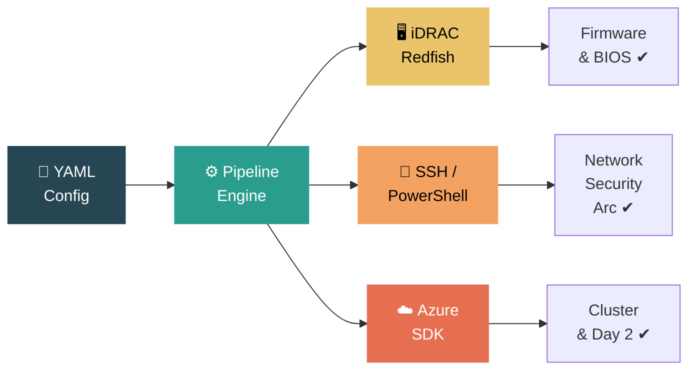

---

## Key Features

| Category | Capabilities |
|---|---|
| **Zero-Touch Deploy** | 17-stage pipeline: firmware, BIOS, OS install, network, security, Arc, cluster creation — all remotely via Redfish + SSH |
| **Add Node** | 15-stage pipeline to expand existing clusters (including single → multi-node conversion) |
| **Rebuild Cluster** | 14-stage pipeline with AI-assisted planning, VM backup/migration, checkpoint/resume |
| **Day 2 Services** | Logical networks, VM images, test VM provisioning — ready to hand off to app teams |
| **Web Wizard** | Flask + Socket.IO browser UI with real-time progress (12-step new cluster, 9-step add node, 7-step rebuild) |
| **REST API** | 60+ endpoints with JWT auth, API keys, RBAC (admin / operator / viewer), SSE streaming |
| **Pre-Flight Validation** | CPU, RAM, disk, TPM, SecureBoot, NIC, reserved-IP, DNS checks before deployment |
| **Environment Checker** | Integrates Microsoft's official `AzStackHci.EnvironmentChecker` module |
| **Security Baseline** | HVCI, Credential Guard, BitLocker, WDAC, SMB signing/encryption, drift control |
| **AI Integration** | OpenAI / Azure OpenAI / Anthropic for rebuild planning and IaC generation |
| **Idempotent & Selective** | Every stage checks state first; re-run safely or pick stages with `--stage` |

---

## Architecture

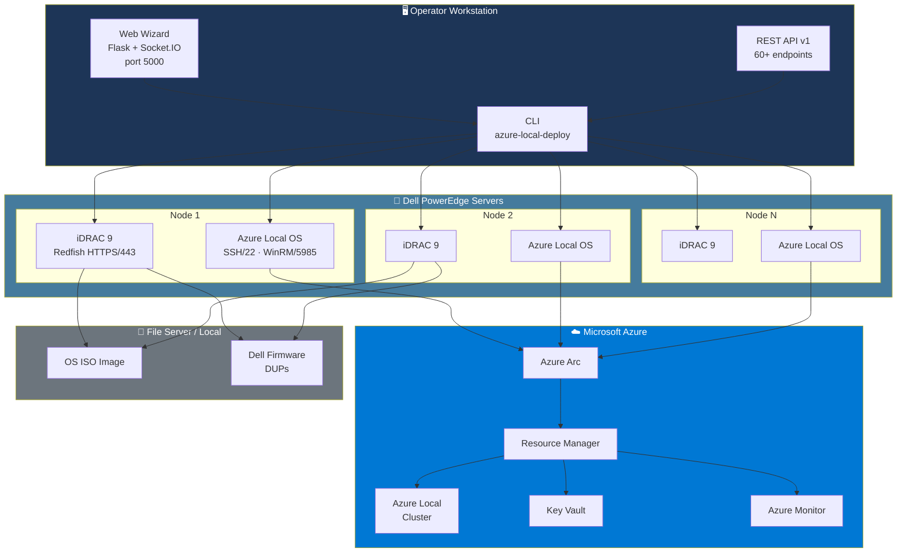

### Component Map

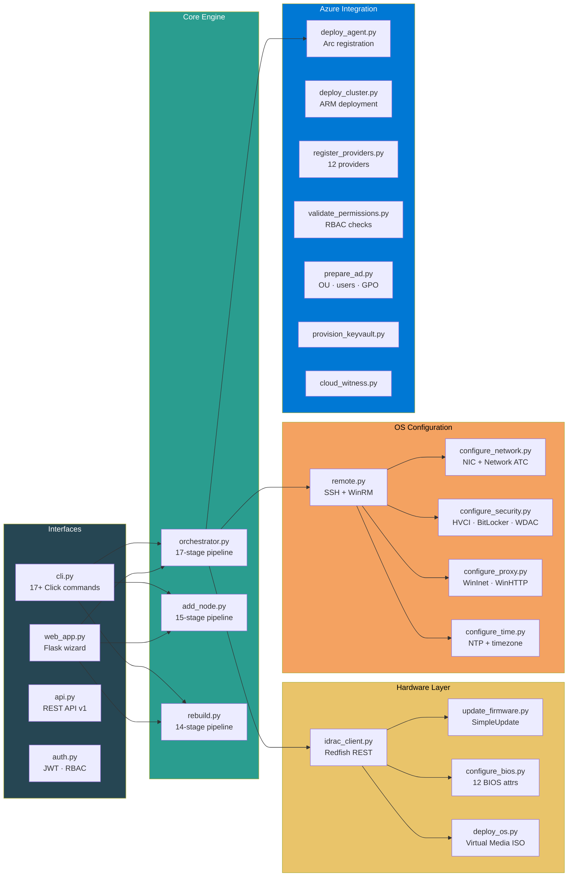

---

## Pipeline Stages

### New Cluster — 17 Stages across 4 Phases

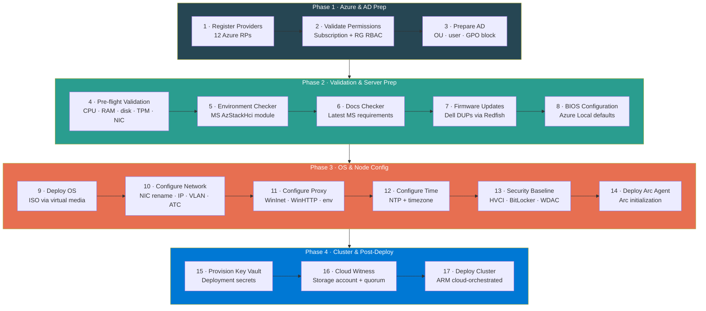

### Add Node — 15 Stages

```mermaid
graph LR
    A1["Validate\nConfig"] --> A2["Pre-flight\nHardware"] --> A3["OS Version\nMatch"] --> A4["Clean\nOS Drives"]
    A4 --> A5["Deploy\nOS"] --> A6["Configure\nNetwork"] --> A7["SBE\nDeploy"]
    A7 --> A8["Arc\nInit"] --> A9["Arc Parity\nCheck"] --> A10["Role\nAssign"]
    A10 --> A11["Pre-Add\nQuorum"] --> A12["Storage\nIntent"] --> A13["Add Node\nvia ARM"]
    A13 --> A14["Post-Join\nSync"] --> A15["Validate\n& Cleanup"]

    style A1 fill:#264653,color:#fff
    style A5 fill:#2a9d8f,color:#fff
    style A8 fill:#e76f51,color:#fff
    style A13 fill:#0078D4,color:#fff
```

### Rebuild Cluster — 14 Stages

```mermaid
graph LR
    R1["Discover\nWorkloads"] --> R2["Map\nDependencies"] --> R3["AI\nPlanning"]
    R3 --> R4["Backup\nVMs"] --> R5["Validate\nBackups"] --> R6["Evacuate\nWorkloads"]
    R6 --> R7["Verify\nEvacuation"] --> R8["Teardown\nNode"] --> R9["Rebuild\nNode"]
    R9 --> R10["Restore\nDay 2"] --> R11["Move Back\nVMs"] --> R12["Post-Move\nValidate"]
    R12 --> R13["Verify\nAll Backups"] --> R14["Cleanup"]

    style R1 fill:#264653,color:#fff
    style R4 fill:#e9c46a,color:#000
    style R8 fill:#e76f51,color:#fff
    style R11 fill:#0078D4,color:#fff
```

---

## Deployment Flow — End to End

```mermaid
sequenceDiagram
    actor Op as Operator
    participant CLI as CLI / Web
    participant iDRAC as Dell iDRAC
    participant Node as Azure Local OS
    participant Azure as Microsoft Azure

    Op->>CLI: deploy config.yaml

    rect rgb(38,70,83)
        Note over CLI,Azure: Phase 1 — Azure & AD Prep
        CLI->>Azure: Register 12 resource providers
        CLI->>Azure: Validate RBAC permissions
        CLI->>Node: Prepare Active Directory
    end

    rect rgb(42,157,143)
        Note over CLI,iDRAC: Phase 2 — Validation & Server Prep
        CLI->>iDRAC: GET /redfish/v1/Systems/System.Embedded.1
        iDRAC-->>CLI: Hardware inventory
        CLI->>CLI: Pre-flight checks (CPU, RAM, NIC, TPM...)
        CLI->>iDRAC: POST SimpleUpdate (firmware DUPs)
        iDRAC-->>CLI: Task ID → poll until complete
        CLI->>iDRAC: PATCH BIOS attributes (12 settings)
        iDRAC-->>CLI: Config job → reboot
    end

    rect rgb(231,111,81)
        Note over CLI,Node: Phase 3 — OS & Node Config
        CLI->>iDRAC: Mount ISO via Virtual Media
        CLI->>iDRAC: Set one-time boot → Virtual CD
        CLI->>iDRAC: Power On
        Note over Node: OS installs (~15 min)
        CLI->>Node: SSH: Configure NICs, VLANs, ATC
        CLI->>Node: SSH: Set proxy, NTP, timezone
        CLI->>Node: SSH: Enable HVCI, BitLocker, WDAC
        CLI->>Node: SSH: Register Azure Arc agent
    end

    rect rgb(0,120,212)
        Note over CLI,Azure: Phase 4 — Cluster Deploy
        CLI->>Azure: Create Key Vault
        CLI->>Azure: Create cloud witness storage
        CLI->>Azure: Deploy cluster (ARM)
        Azure-->>CLI: Provisioning... → Succeeded
    end

    Op->>CLI: day2 config.yaml
    CLI->>Node: Create logical networks
    CLI->>Node: Upload VM images
    CLI->>Node: Provision test VMs
```

---

## Before vs After

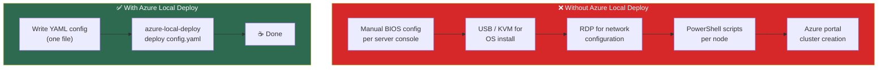

---

## Prerequisites

| Requirement | Details |
|---|---|
| **Python** | 3.10 or higher |
| **Dell servers** | PowerEdge 15th/16th Gen with iDRAC 9 (Redfish enabled) |
| **Network** | Operator workstation can reach iDRAC IPs (HTTPS/443) and node management IPs (SSH/22) |
| **Azure Local OS ISO** | Downloaded and accessible via HTTP, CIFS, or NFS share |
| **Azure subscription** | With permissions to register providers, create resources, and assign roles |
| **Active Directory** | Domain controller reachable from nodes (for AD prep and domain join) |
| **Dell firmware DUPs** | *(Optional)* Downloaded from [dell.com/support](https://dell.com/support) for firmware updates |

---

## Installation

```bash
# Clone the repository
git clone https://github.com/<your-org>/azure-local-deplpy-app.git
cd azure-local-deplpy-app

# Create virtual environment
python -m venv .venv

# Activate (Windows)
.venv\Scripts\activate

# Activate (Linux/macOS)
# source .venv/bin/activate

# Install with all dependencies
pip install -e .
```

Verify the installation:

```bash
azure-local-deploy --help
```

---

## Configuration

All deployment parameters are defined in a single YAML file. Copy the sample and edit:

```bash
cp deploy-config.sample.yaml deploy-config.yaml
```

### Configuration Structure

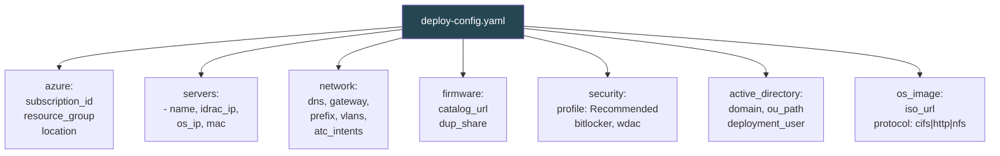

<details>
<summary><b>Full YAML Example (click to expand)</b></summary>

```yaml
azure:
  subscription_id: "xxxxxxxx-xxxx-xxxx-xxxx-xxxxxxxxxxxx"
  resource_group: "rg-azurelocal-prod"
  location: "eastus"
  tenant_id: "xxxxxxxx-xxxx-xxxx-xxxx-xxxxxxxxxxxx"

cluster:
  name: "my-cluster"
  domain: "corp.contoso.com"
  cloud_witness_storage: "cwmycluster"

servers:
  - name: "node01"
    idrac_ip: "192.168.10.4"
    os_ip: "192.168.1.30"
    mac_address: "AA:BB:CC:DD:EE:01"
  - name: "node02"
    idrac_ip: "192.168.10.5"
    os_ip: "192.168.1.31"
    mac_address: "AA:BB:CC:DD:EE:02"

network:
  management_gateway: "192.168.1.1"
  management_prefix: 24
  dns_servers:
    - "192.168.1.10"
  management_vlan: null
  atc_intents:
    - name: "ConvergedIntent"
      traffic_types: ["Management", "Compute", "Storage"]
      adapters: ["NIC1", "NIC2"]

os_image:
  iso_url: "http://192.168.10.201:8089/AzureLocal.iso"
  protocol: "http"

firmware:
  update: true
  dup_share: "\\\\fileserver\\dups"

security:
  profile: "Recommended"
  bitlocker_boot: true
  bitlocker_data: true
  wdac: true

active_directory:
  domain: "corp.contoso.com"
  ou_path: "OU=AzureLocal,DC=corp,DC=contoso,DC=com"
  deployment_user: "ald-deploy"

proxy:
  http_proxy: null
  https_proxy: null
  no_proxy: "localhost,127.0.0.1,.corp.contoso.com"
```

</details>

---

## Usage — CLI

### Full Deployment

```bash
# Deploy a new cluster (all 17 stages)
azure-local-deploy deploy deploy-config.yaml

# Run a specific stage only
azure-local-deploy deploy deploy-config.yaml --stage firmware

# Dry-run to preview actions
azure-local-deploy deploy deploy-config.yaml --dry-run
```

### Add Node to Existing Cluster

```bash
azure-local-deploy add-node add-node-config.yaml
```

### Rebuild Cluster

```bash
# Full 14-stage rebuild with AI planning
azure-local-deploy rebuild rebuild-config.yaml

# Standalone VM backup
azure-local-deploy backup-vms rebuild-config.yaml
```

### Validation & Checks

```bash
# Validate YAML config syntax
azure-local-deploy validate deploy-config.yaml

# Hardware pre-flight checks
azure-local-deploy preflight deploy-config.yaml

# Microsoft Environment Checker
azure-local-deploy env-check deploy-config.yaml

# Fetch latest MS docs requirements
azure-local-deploy check-docs deploy-config.yaml

# Azure RBAC permission check
azure-local-deploy check-permissions deploy-config.yaml

# Azure resource provider registration
azure-local-deploy check-providers deploy-config.yaml
```

### Day 2 Services

```bash
# Create logical networks, upload images, provision test VMs
azure-local-deploy day2 deploy-config.yaml

# List existing Day 2 resources
azure-local-deploy list-day2 deploy-config.yaml
```

### Other Commands

```bash
# Prepare Active Directory
azure-local-deploy prepare-ad deploy-config.yaml

# Apply security baseline
azure-local-deploy configure-security deploy-config.yaml

# Provision Key Vault
azure-local-deploy provision-keyvault deploy-config.yaml

# Create cloud witness
azure-local-deploy cloud-witness deploy-config.yaml

# Post-deployment tasks
azure-local-deploy post-deploy deploy-config.yaml

# List all available stages
azure-local-deploy list-stages
```

### All CLI Commands

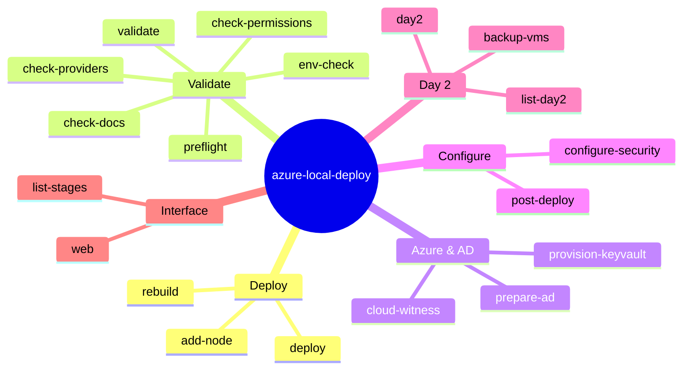

---

## Usage — Web Wizard

Launch the browser-based wizard for guided, visual deployments:

```bash
azure-local-deploy web --port 5000
```

Open **http://localhost:5000** in your browser.

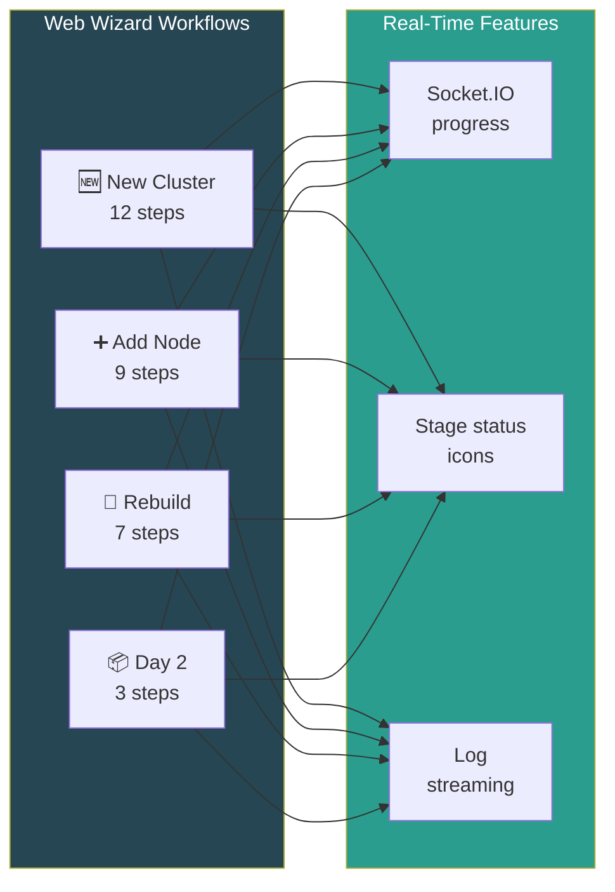

The web wizard uses **Bootstrap 5** with a dark theme and includes:
- Step-by-step forms for cluster configuration
- Real-time progress tracking via Socket.IO
- Review page before execution
- Live log streaming during deployment

---

## REST API

The `web` command also exposes a full REST API at `/api/v1/`:

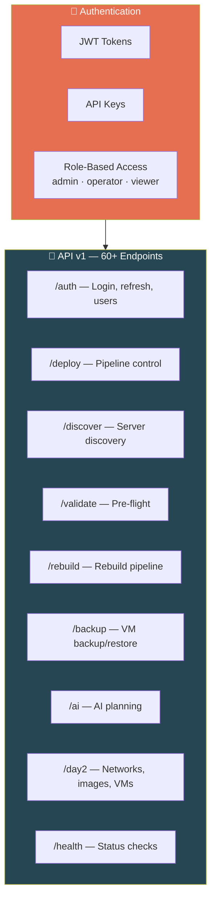

Default credentials: `admin` / `admin123` (forced change on first login).

A Python SDK client is included:

```python
from azure_local_deploy.api_client import RebuildAPIClient

client = RebuildAPIClient("http://localhost:5000")
client.login("admin", "admin123")

# Discover VMs on a node
vms = client.discover_vms("node01")

# Start a rebuild pipeline
job = client.start_rebuild(config)
for event in client.stream_events(job["job_id"]):
    print(event)
```

---

## AI Integration

The rebuild pipeline supports AI-assisted planning via configurable providers:

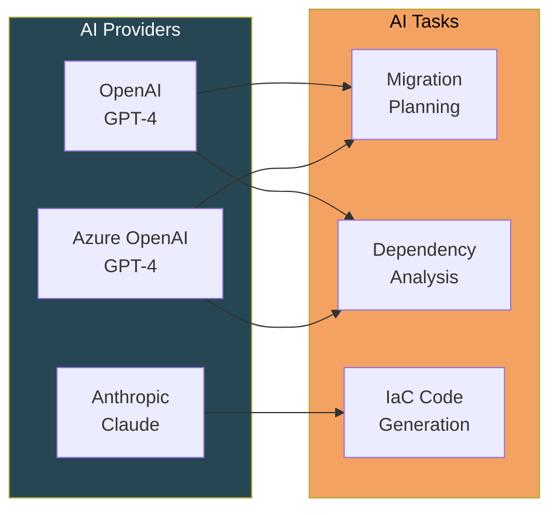

- **Primary** (OpenAI / Azure OpenAI): Migration wave planning, dependency analysis, risk assessment
- **Secondary** (Anthropic Claude): Infrastructure-as-Code generation, remediation scripts

---

## BIOS Settings Reference

Azure Local Deploy configures these BIOS attributes automatically:

| Attribute | Required Value | Purpose |
|---|---|---|
| `SysProfile` | `PerfOptimized` | Maximum performance profile |
| `LogicalProc` | `Enabled` | Hyper-Threading for VM density |
| `VirtualizationTechnology` | `Enabled` | Intel VT-x for Hyper-V |
| `VtForDirectIo` | `Enabled` | VT-d for SR-IOV passthrough |
| `SriovGlobalEnable` | `Enabled` | SR-IOV for network virtualization |
| `SecureBoot` | `Enabled` | UEFI Secure Boot |
| `BootMode` | `Uefi` | UEFI boot (required) |
| `TpmSecurity` | `On` | TPM 2.0 for BitLocker |
| `TpmActivation` | `Enabled` | Active TPM |
| `PxeDev1EnDis` | `Enabled` | PXE boot capability |
| `WorkloadProfile` | `HCIEnabled` | Dell HCI workload optimization |
| `SystemModelName` | *(validated)* | Confirms supported model |

---

## Security Baseline

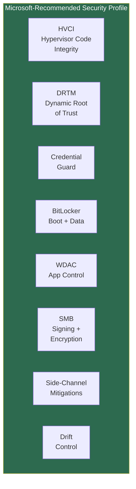

Two profiles available:
- **Recommended** — Full Microsoft security baseline (all of the above)
- **Customized** — Select individual settings via YAML config

---

## Project Layout

```
azure-local-deplpy-app/
├── src/azure_local_deploy/          # Main Python package (~9,700 lines)
│   ├── cli.py                       # Click CLI — 17+ commands
│   ├── orchestrator.py              # 17-stage new-cluster pipeline
│   ├── add_node.py                  # 15-stage add-node pipeline
│   ├── rebuild.py                   # 14-stage rebuild pipeline
│   ├── web_app.py                   # Flask + Socket.IO web wizard
│   ├── api.py                       # REST API v1 (60+ endpoints)
│   ├── api_client.py                # Python SDK client
│   ├── auth.py                      # JWT + RBAC authentication
│   ├── ai_provider.py              # OpenAI / Azure OpenAI / Anthropic
│   ├── models.py                    # Shared data models & enums
│   ├── idrac_client.py              # Dell iDRAC Redfish client
│   ├── update_firmware.py           # Dell firmware updates
│   ├── configure_bios.py            # BIOS configuration
│   ├── deploy_os.py                 # OS install via virtual media
│   ├── configure_network.py         # NIC, VLAN, Network ATC
│   ├── configure_time.py            # NTP + timezone
│   ├── configure_proxy.py           # WinInet / WinHTTP / env proxy
│   ├── configure_security.py        # HVCI, BitLocker, WDAC
│   ├── deploy_agent.py              # Azure Arc registration
│   ├── deploy_cluster.py            # ARM cluster deployment
│   ├── register_providers.py        # Azure resource providers
│   ├── validate_permissions.py      # RBAC validation
│   ├── validate_nodes.py            # Hardware pre-flight
│   ├── environment_checker.py       # MS Environment Checker
│   ├── docs_checker.py              # Online docs parser
│   ├── prepare_ad.py                # Active Directory prep
│   ├── provision_keyvault.py        # Azure Key Vault
│   ├── cloud_witness.py             # Cloud witness storage
│   ├── post_deploy.py               # Post-deploy tasks
│   ├── day2_services.py             # Day 2: networks, images, VMs
│   ├── remote.py                    # SSH + WinRM execution
│   ├── azure_auth.py                # Azure credential factory
│   ├── utils.py                     # Logger, retry, validation
│   └── templates/                   # 36 Jinja2 HTML templates
├── tests/                           # 11 test modules
├── designs/                         # Architecture documents
├── dups/                            # Dell firmware DUPs (git-ignored)
├── pyproject.toml                   # Project metadata & deps
├── requirements.txt                 # Pinned dependencies
├── deploy-config.sample.yaml        # Sample configuration
└── README.md                        # This file
```

### Module Dependency Graph

```mermaid
graph TD
    CLI["cli.py"] --> ORC["orchestrator.py"]
    CLI --> ADD["add_node.py"]
    CLI --> REB["rebuild.py"]
    CLI --> WEB["web_app.py"]

    ORC --> VAL["validate_nodes.py"]
    ORC --> ENV["environment_checker.py"]
    ORC --> FW["update_firmware.py"]
    ORC --> BIOS2["configure_bios.py"]
    ORC --> DOS2["deploy_os.py"]
    ORC --> NET2["configure_network.py"]
    ORC --> SEC2["configure_security.py"]
    ORC --> PRX2["configure_proxy.py"]
    ORC --> TIME2["configure_time.py"]
    ORC --> ARC3["deploy_agent.py"]
    ORC --> CLU2["deploy_cluster.py"]
    ORC --> REG2["register_providers.py"]
    ORC --> PERM2["validate_permissions.py"]
    ORC --> AD3["prepare_ad.py"]
    ORC --> KV3["provision_keyvault.py"]
    ORC --> CW2["cloud_witness.py"]

    FW --> IDR["idrac_client.py"]
    BIOS2 --> IDR
    DOS2 --> IDR
    NET2 --> REM2["remote.py"]
    SEC2 --> REM2
    ARC3 --> REM2

    WEB --> API3["api.py"] --> AUTH2["auth.py"]
    REB --> AI["ai_provider.py"]

    IDR --> UTL["utils.py"]
    REM2 --> UTL

    style CLI fill:#264653,color:#fff
    style ORC fill:#2a9d8f,color:#fff
    style IDR fill:#e9c46a,color:#000
    style REM2 fill:#f4a261,color:#000
```

---

## Authentication & RBAC

The web wizard and REST API use a multi-layer authentication system:

| Method | Use Case |
|---|---|
| **JWT tokens** | Browser sessions, short-lived access + refresh tokens |
| **API keys** | Machine-to-machine integration, long-lived |
| **RBAC roles** | `admin` (full), `operator` (deploy + day2), `viewer` (read-only) |
| **Password policy** | Min 8 chars, uppercase, lowercase, digit, special char |

---

## Troubleshooting

| Symptom | Check |
|---|---|
| **Cannot reach iDRAC** | Verify HTTPS/443 is open; test `curl https://<idrac_ip>/redfish/v1/` |
| **Firmware update fails** | Ensure DUP share is reachable from iDRAC; check Lifecycle Controller logs |
| **OS install hangs** | Verify ISO is accessible (HTTP/CIFS/NFS); check virtual media mount in iDRAC web UI |
| **SSH connection refused** | OS install may still be in progress; wait for SSH to come up (~15 min) |
| **Arc registration fails** | Check proxy settings; verify subscription permissions; run `env-check` |
| **Cluster deploy fails** | Run `check-permissions` and `check-providers`; verify Key Vault and cloud witness |
| **BIOS job stuck** | Check iDRAC job queue: `GET /redfish/v1/Managers/iDRAC.Embedded.1/Jobs` |
| **Pre-flight warnings** | Review the validation report; warnings may be non-blocking |

---

## Development

### Setup

```bash
# Install with dev dependencies
pip install -e ".[dev]"

# Run tests
pytest tests/ -v

# Linting
ruff check src/

# Type checking
mypy src/azure_local_deploy/
```

### Test Suite

```bash
# All tests
pytest

# Specific module
pytest tests/test_bios.py -v

# With coverage
pytest --cov=azure_local_deploy --cov-report=term-missing
```

### Tech Stack

| Layer | Technology |
|---|---|
| **Language** | Python 3.10+ |
| **CLI** | Click |
| **Web** | Flask + Flask-SocketIO |
| **Auth** | PyJWT + bcrypt |
| **Console UI** | Rich |
| **Hardware API** | Dell iDRAC Redfish (requests) |
| **Remote exec** | paramiko (SSH) + WinRM |
| **Azure SDK** | azure-identity, azure-mgmt-azurestackhci, azure-mgmt-resource |
| **AI** | openai, anthropic |
| **Testing** | pytest + pytest-cov |
| **Linting** | ruff + mypy |

---

## License

This project is licensed under the **MIT License**. See [LICENSE](LICENSE) for details.

---

<div align="center">

**Built for infrastructure engineers who believe bare-metal provisioning shouldn't require bare-metal access.**

</div>
